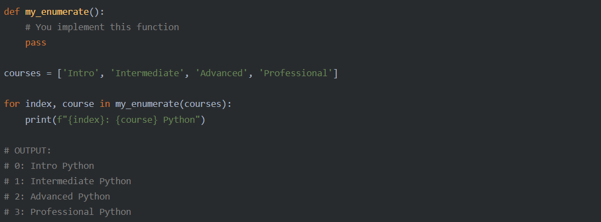

## Table of contents:
- [Introduction](#intro)
- [Technologies](#tech)
- [project Setup](#projo)
- [Illustrations](#illus)
- [Project Information](#info)
- [Contributing](#contri)
- [Acknowledgments](#know)

<INTRODUCTION>

<h1 id="intro">Custom Enumerate</h1>

## brief
Recreate a similar function as the enumerate function


## Task:
    ```
     This project will train you in your understanding of data types, writing functions, and reading documentation.

     Your task is to create a function called my_enumerate() that mirrors the functionality of Python's built-in enumerate().

     Don't just copy the range(len(sequence)) example and work off of it. Instead, go online, train your search engine skills, and research how enumerate() works internally. Then use this to inform your design decisions for your custom my_enumerate() function.

     Ultimately, you should be able to use my_enumerate() as a drop-in replacement for enumerate() that can be used in the same way, and will produce the same results:
    ```


<TECHNOLOGIES>

<h1 id="tech">Technologies</h1>

## Builth With
- Python


<PROJECT-SETUP>

<h1 id="projo">Project Setup</h1>


## Hardware Requirements
- You will need a desktop or a laptop computer
- RAM: A minimum of 4GB RAM is recommended
- Disk Space: You should have at least 5GB free of space on your working hard drive

## Software Requirements

## Prerequisites

To get this project up and running locally, you must already have python plus the necessary packages installed on your computer

**simple steps to set up on your local machine**

```
- $ git clone `$ git clone https://github.com/symonkipkemei/my-enumerate.git`
- $ git checkout develop
- Run `python my-enumerate.py`
```

- [Live Version](https://replit.com/@symonkipkemei/my-enumerate#my-enumerate.py)


<ILLUSTRATIONS>

<h1 id="illus">Illustrations</h1>


<PROJECT-INFORMATION>

<h1 id="info">Project Information</h1>

## Project Status
- In development

## Features
- A decoding option
- Allow user to paste long paragraphs
- An interface to allow the user to choose between encrypting and decrypting

## TODO


<CONTRIBUTING>

<h1 id="contri">🤝 Contributing</h1>

Contributions, issues and feature requests are always welcome!

I love meeting other developers, interacting and sharing.

Feel free to check the [issues page](https://github.com/symonkipkemei/my-enumerate/issues).

### How to Contribute

To get a local copy up and running follow these simple example steps.

```
- Fork the repository
- git clone https://github.com/your_username/my-enumerate
- git checkout develop
- git checkout -b branch name
- git remote add upstream https://github.com/symonkipkemei/my-enumerate
- git pull upstream develop
- git commit -m "commit message"
- git push -u origin HEAD
```


<ACKNOWLEDGMENTS>

<h1 id="know">Acknowledgements</h1>

## Author

👤 **Symon Kipkemei**

- Github: [symonkipkemei](https://github.com/symonkipkemei)
- Twitter: [@symon_kipkemei](https://twitter.com/symon_kipkemei)
- LinkedIn: [Symon kipkemei](https://www.linkedin.com/in/symon-kipkemei/)


## Show your support

Finally, if you've read this far, don't forget to give this repo a ⭐️. They're free . . . .

## Acknowledgments

- [codingnomads](https://codingnomads.co/).
